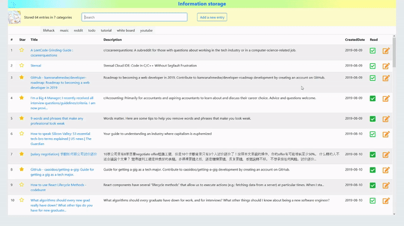

# Bookmarks Manager

[Demo available here](https://yatw-bookmark.herokuapp.com/)



I also have my own [firefox browser extension](https://github.com/yatw/Savedis) to quickly save any web page.  

## About the project


### Technologies

- **Frontend**: React, Bootstrap, CSS
- **Backend**:  Node.js, Express
- **Database**: MySQL
- **Language**: JavaScript
- **Deployment**: Heroku, ClearDB MySQL

### Features

- [x] Insert Modal
- [x] Edit Modal (with Delete)
- [x] Star/Complete toggle
- [x] Automatically extract website info
- [x] Automatically generate created-date
- [x] Automatically select known tag
- [x] Filter on search
- [x] Prevent duplication on insert
- [x] Hosting
- [x] Sorting
- [x] Tags
- [x] Notification
- [x] User Session
- [x] Force login after session expire
- [ ] Export Storage
- [x] Bootstrap CORS 


#### Known Issue

1. ClearDB MySQL will automatically disconnect as explained [here](https://stackoverflow.com/questions/18433124/heroku-and-nodejs-mysql-connection-lost-the-server-closed-the-connection), this sometimes causes delay because server has to establish a new connection.

2. Sometimes Bootstrap can't load due to ```Cross-Origin Request Blocked: The Same Origin Policy disallows reading the remote resource at https://stackpath.bootstrapcdn.com/bootstrap/4.3.1/css/bootstrap.min.css. (Reason: CORS request did not succeed).```

3. Free Hosting on Heroku means the app will inevitably "sleep". While the frontend may look normal and active, any backend request may take a while to "wake" the server up again.

4. App will crash if the amount of requests to database exceeded the free plan.

#### Challenges

1. React child components depend on the state of each other. For example, table display links according to the search term and tags state in the navigation. Therefore, on search term input, navigation needs to notify app about update, and app then notify table.

## Documentation
[Frontend Backend structure](Documentation.md)


## Instructions

### Dependencies

**Note the following was done in Window OS**

**To start running locally**

1. Check [.env file](envStructure.md) is present
2. Open project in visual studio code from command prompt
```
code .
```
3. Start back end Node.js server
```
npm install
npm run dev
```
4. Start front end react server
```
cd client
npm install
npm start
```

### Deploying to Heroku

Do this everytime!

```cd client``` and delete ```build``` folder, then do ```npm run build``` to get ready for production

For First time set up

In the backend `package.json` file, Heroku will use `npm start` to start the server.
`heroku-postbuild` is used to start the frontend react server


Start react server with ```npm run build``` instead of the usual ```npm start```, otherwise Heroku build will not complete

```
  "scripts": {
    "start": "node server.js",
    "dev": "nodemon app --ignore client",
    "heroku-postbuild": "cd client && npm install && npm run build"
  },
```


Start the project on Heroku
```
heroku login // enter in your credentials
heroku create [project-name]
git add .
git commit -m "react-create-app on Heroku"
git push heroku master
heroku open
```

To add Heroku as a remote
```
heroku git:remote -a yatw-bookmark
```

[Relevant Guide](https://medium.com/@chloechong.us/how-to-deploy-a-create-react-app-with-an-express-backend-to-heroku-32decfee6d18)
